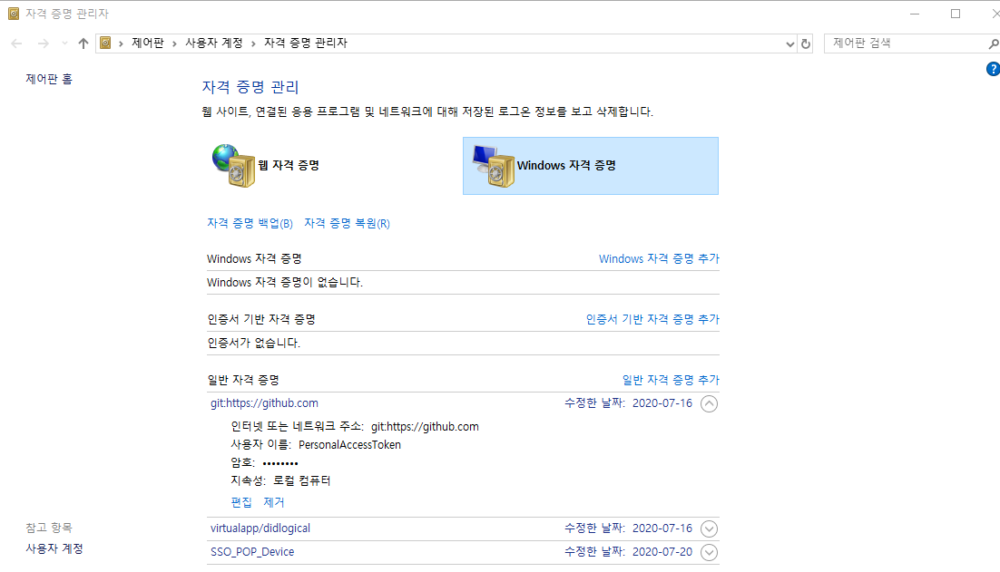

# 0721 self_study

## 1. 환경설정 - git자격 지우기

1. 자격 증명 관리자

   1. 윈도우 자격 증명

      

      여기서 `제거`버튼을 누르면 로컬에 저장된 git 관련 내용을 지울 수 있다.

      더 이상 이곳에서 작업을 하지 않을 때나, 새롭게 다시 설치할 때 사용한다

   3. 

## 2. map, lamda, list 함수

#### 2-1. map

map(f, iterable)은 함수(f)와 반복 가능한(iterable) 자료형을 입력으로 받는다. map은 입력받은 자료형의 각 요소를 함수 f가 수행한 결과를 묶어서 돌려주는 함수이다.

다음 예를 보자.

```
# two_times.py
def two_times(numberList):
    result = [ ]
    for number in numberList:
        result.append(number*2)
    return result

result = two_times([1, 2, 3, 4])
print(result)
```

two_times 함수는 리스트 요소를 입력받아 각 요소에 2를 곱한 결괏값을 돌려준다. 실행 결과는 다음과 같다.

> 결과값: [2, 4, 6, 8]

위 예제는 map 함수를 사용하면 다음처럼 바꿀 수 있다.

```
>>> def two_times(x): 
...     return x*2
...
>>> list(map(two_times, [1, 2, 3, 4]))
[2, 4, 6, 8]
```

이제 앞 예제를 해석해 보자. 먼저 리스트의 첫 번째 요소인 1이 two_times 함수의 입력값으로 들어가고 `1 * 2`의 과정을 거쳐서 2가 된다. 다음으로 리스트의 두 번째 요소인 2가 `2 * 2` 의 과정을 거쳐 4가 된다. 따라서 결괏값 리스트는 이제 [2, 4]가 된다. 총 4개의 요솟값이 모두 수행되면 마지막으로 [2, 4, 6, 8]을 돌려준다. 이것이 map 함수가 하는 일이다.

> ※ 위 예에서 map의 결과를 리스트로 보여 주기위해 list 함수를 사용하여 출력하였다.


#### 2-2. lamda

> 함수를 재활용할 필요가 없고, 일시적으로 사용할 때는 lamda함수를 쓰는 것이 좋다.

앞의 예는 lambda를 사용하면 다음처럼 간략하게 만들 수 있다.

```
>>> list(map(lambda a: a*2, [1, 2, 3, 4]))
[2, 4, 6, 8]
```


#### 2-3. list

list(s)는 반복 가능한 자료형 s를 입력받아 리스트로 만들어 돌려주는 함수이다.

```
>>> list("python")
['p', 'y', 't', 'h', 'o', 'n']
>>> list((1,2,3))
[1, 2, 3]
```

참고.

https://wikidocs.net/22803

https://wikidocs.net/32#map

https://dojang.io/mod/page/view.php?id=2286

---

## 3. 좋은 블로그 글

https://bluese05.tistory.com/64?category=559959

https://bluese05.tistory.com/66?category=559959