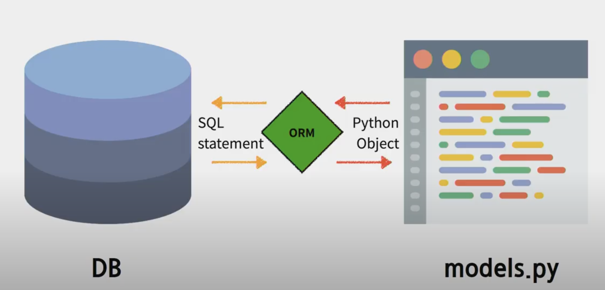
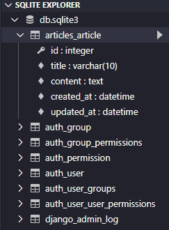
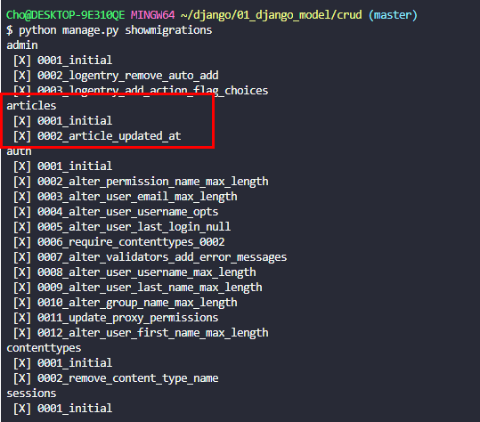
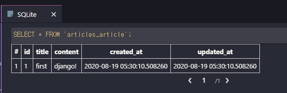
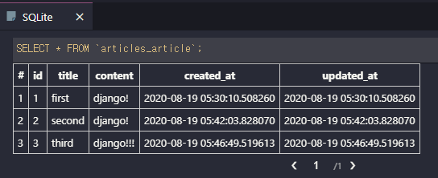

# 0819 django MODEL

## 1. Model의 특성

- 데이터에 대한 단 하나의 정보 소스
- 저장된 데이터베이스의 구조(Layout)을 의미
- 사용자가 저장하는 데이터들의 필수적인 필드들과 동작들을 포함
- django는 model을 통해 데이터에 접속하고 관리
- 일반적으로 각각의 model은 하나의 데이터베이스 테이블에 매핑

- **장고의 Model은 DB와 같은 것이 아니다.** 
  - db를 관리하는 장고의 기능(?)이라는 개념이다.


### 데이터 베이스(DB) 기본 개념

- 데이터베이스(db)
  - 체계화된 데이터의 모임
- 쿼리(Query)
  - 데이터를 조회하기 위한 명령어
  - 조건에 맞는 데이터를 추출하거나 조작하는 명령어
- 테이블(Table)

| 행     | 열   |
| ------ | ---- |
| 레코드 | 필드 |

- PK(기본키, Primary Key)
  - 각 행(레코드)의 고유값으로, 반드시 설정해야 하며 데이터베이스 관리 및 관계 설정 시 주요하게 활용됨.


### ORM

"Object  Relational Mapping"은 객체 지향 프로그래밍 언어를 사용하여 `호환되지 않는 유형의 시스템간(Django ~ SQL)에 데이터를 변환`하는 프로그래밍 기술.

프로그래밍 언어에서 사용할 수 있는 `가상 객체 데이터베이스`를 만들어 사용한다.




- ORM장점
  - SQL 잘 알지 못해도 DB조작 가능
  - SQL의 절차적 접근이 아닌 객체 지향적 접근으로 인한 높은 생산성
  - 현대 웹 프레임워크의 요점은 웹 개발의 속도를 높이는 것(**생산성**). 때문에 ORM이 많이 각광받음.
- ORM단점
  - ORM만으로 완전한 서비스를 구현하기 어려운 경우가 있음


---

## 2. Model 만들기

### 1. Models.py

```python
from django.db import models
# Articles라는 App을 만들었고 class 명은 그 앱의 단수형(Article)을 사용함
class Article(models.Model):	# Model 상속
    title = models.CharField(max_length=10)   
    content = models.TextField()              
    created_at = models.DateTimeField(auto_now_add=True)            
    #DateFiled 는 시간  X, DateTimeFiled는 시간 O. auto_now_add는 필수인자, True면 처음 작성시간을 저장. 수정되지 않음.
```

django github model 클래스 찾아보기 (line 404부터)

https://github.com/django/django/blob/master/django/db/models/base.py


#### CharField(max_length=None)

- 길이 제한이 있는 문자열을 넣을 때 사용

- `max_length` 필수인자

- 필드의 최대 길이, 데이터베이스와 django의 유효성 검사에서 사용

- 기본적으로 html의 `input` tag를 쓴다.

  

#### TextField()

- 글자 수 많을 때 사용(길이 제한 X)
- 필수 인자 없음
- 기본적으로 html의 `textarea` tag를 쓴다.


#### DateTimeField(auto_now_add=)

- 최초 생성 일자(auto_now_add)
  - django ORM이 최초 데이터 입력시에만 현재 날짜와 시간으로 갱신
  - 테이블에 데이터를 최초로 넣을 때
- 최종 수성 일자 (auto_now)
  - django ORM이 저장(SAVE)할 때마다 갱신


#### Migrations 명령어

- `makemigrations`

  - model을 변경한 것에 기반한 새로운 마이그레이션을 만들 때 사용 

  - 모델을 활성화하기 전에 DB설계도 작성

  - 생성된 마이그레이션 파일은 데이터베이스 스키마를 위한 버전관리 시스템이라고 생각.

  - model의 변경사항에 대한 역사. `git commit`과 비슷한 개념.

    ```python
    $ python manage.py makemigrations
    Migrations for 'articles':
      articles\migrations\0002_article_updated_at.py
        - Add field updated_at to article
    ```

    

- `migrate`

  - 작성된 마이그레이션 파일들을 기반으로 실제 DB에 반영함.

  - db.sqlite3 라는 데이터베이스 파일에 테이블을 생성

  - 모델에서의 변경 사항들과 DB의 스키마가 동기화를 이룸.

    

    ```python
    $ python manage.py migrate
    Operations to perform:
      Apply all migrations: admin, articles, auth, contenttypes, sessions
    Running migrations:
      Applying contenttypes.0001_initial... OK
      Applying auth.0001_initial... OK
      Applying admin.0001_initial... OK
      Applying admin.0002_logentry_remove_auto_add... OK
      Applying admin.0003_logentry_add_action_flag_choices... OK
      Applying articles.0001_initial... OK
      Applying articles.0002_article_updated_at... OK
      Applying contenttypes.0002_remove_content_type_name... OK
      Applying auth.0002_alter_permission_name_max_length... OK
      Applying auth.0003_alter_user_email_max_length... OK
      Applying auth.0004_alter_user_username_opts... OK
      Applying auth.0005_alter_user_last_login_null... OK
      Applying auth.0006_require_contenttypes_0002... OK
      Applying auth.0007_alter_validators_add_error_messages... OK
      Applying auth.0008_alter_user_username_max_length... OK
      Applying auth.0009_alter_user_last_name_max_length... OK
      Applying auth.0010_alter_group_name_max_length... OK
      Applying auth.0011_update_proxy_permissions... OK
      Applying auth.0012_alter_user_first_name_max_length... OK
      Applying sessions.0001_initial... OK
    ```

    

- `sqlmigrate`

  - python manage.py sqlmigrate {App_name} {번호}

  - ```python
    >>> python manage.py sqlmigrate articles 0001
    ```

  - 마이그레이션에 대한 SQL구문을 보기 위해 사용

  

- `showmigrations`

  - 프로젝트 전체의 마이그레이션과 각각의 상태를 확인하기 위해 사용



#### Model의 중요 3단계

1. models.py : 변경사항 발생
2. makemigrations: 설계도 만들기
3. migrate: DB에 적용

```
1. models.py에서 집 지을 계획을 작성/수정/삭제한다. (엄마방 아빠방 내방 언니방 동생방)
2. makemigrations를 통해 설계도를 제작한다.
3. 설계도만 있다고 집이 알아서 지어지느냐? 아니다! migrate를 통해 집 짓는 과정이 필요하다.
-> 우리가 이사를 가거나 집을 살 때 집 주소를 직접 만들지 않는 것처럼, 집이 만들어지고 나면 집 주소는 자동으로 부여된다. 그것이 바로 id!!
```


#### DB API

- django 가 기본적으로 ORM을 제공함에 따른 것으로 DB를 편하게 조작할 수 있도록 도와줌
- Model을 만들면 django는 객체들을 만들고 CRUD할 수 있는 database-abstract API를 자동으로 만듦
- database-abstract API혹은 database-access API라고 함

```python
구조
Articles.objects.all()
	1		2	   3	
Class Name. Manager. QuerySet API
```

Manager

- django 모델에 데이터베이스 query작업이 제공되는 인터페이스
- 기본적으로 모든 django 모델 클래스에 objects라는 manager를 추가

QuerySet

- 데이터베이스로부터 전달 받은 객체 목록
- queryset안의 객체는 0개, 1개 혹은 여러개 
- 데이터베이스로부터 조회, 필터, 정렬 등을 수행할 수 있음.


---

## 3. CRUD 

일단 두 개의 extensions를 설치한다.

```bash
1. ipython
2. django-extensions

한 번에 설치하는 명령어
$pip install ipython django-extensions
```


```bash
$ python manage.py shell_plus

shell_plus를 사용하면 좋은점.
- 기본적으로 필요한 모듈과 models 들이 자동으로 import된다.
```


- 대부분의 컴퓨터 소프트웨어가 가지는 기본적인 데이터 처리 기능
  - Create(생성) / Read(읽기) / Update(갱신) / Delete(삭제) 

### READ

1.  **.all()** : 모두 불러오기
   - **List는 아니지만 List와 거의 비슷하게 동작(조작 가능)**
   - queryset으로 Return함.
   - 중요한 것은, 값이 없더라도 0을 리턴하는게 아니라 QuerySet을 Return한다.

```python
<초기>
Article.objects.all()
>>> <QuerySet[]>

정상 작동했으나 table이 비어 있어서 빈 리스트 값이 넘어왔다.
QuerySet에서는 리스트처럼 슬라이싱 가능함.
값을 Create하고 다시 조회해 보았다.

<Create 후 재조회>
 In [1]: Article.objects.all()
 Out[1]: <QuerySet [<Article: Article object (1)>, <Article: Article object (2)>, <Article: Article object (3)>]>

-> object가 조회되긴 하는데 사람이 알아보기 힘들다. 이럴 때는 Class의 __str__ 매직메서드를 사용해서 알아볼 수 있게 만들 수 있다.

<수정중>
(1) Models.py 의 Article Class에 __str__ 메서드를 추가해준다.
def __str__(self):
        return self.title          								# <- 일반적인 방법
		return f'{self.pk}번 글의 제목은 {self.title}입니다.'	   # <- f-strings로 표현할 수도 있음

<결과>
 In [1]: Article.objects.all()
 Out[1]: <QuerySet [<Article: 1번 글의 제목은 first입니다.>, <Article: 2번 글의 제목은 second입니다.>, <Article: 3번 글의 제목은 third입니다.>]>

```

2. 개별조회 - **.get()**

   - 객체가 없으면 `DoesNotExist` 에러 발생
   - 객체가 여러개일 경우는 `MultipleObjectReturned` 에러 발생
   - 위와 같은 특징을 가지고 있기 때문에 `unique` 혹은 `NotNull특징`을 가지고 있으면 사용할 수 있다 (pk)
   - **따라서 실제로는 pk값으로 개별 객체를 부를때에만 사용한다.**

3. .filter()

   ```python
   Article.objects.filter(content="django!")
   ```

   - 지정된 조회 매개 변수와 일치하는 객체를 포함하는 QuerySet을 Return 함
   - 찾고자 하는 데이터가 두 개 이상일 수 있는 경우 사용
   - .all()과 마찬가지로, 값이 없더라도 0을 리턴하는게 아니라 QuerySet을 Return한다. 

### Create

1. 첫 번째 방법

```python
In [2]: article = Article()

In [3]: article
Out[3]: <Article: Article object (None)>    #<-- 아직 인스턴스만 생성하고 DB에 record가 없기 때문에 pk 값이 None으로 나옴
      
In [4]: article.title = 'first'
In [5]: article.content = 'django!'
In [6]: article.save()
    
In [7]: article
Out[7]: <Article: Article object (1)>       #<-- save() 메소드를 사용해 저장하고 나서야 pk=1이 생성됨.
```




			2. 두 번째 방법 - 생성하면서 데이터도 같이 넣어서 만들기

```python
In [1]: article = Article(title='second', content='django!')

In [2]: article
Out[2]: <Article: Article object (None)>

In [3]: article.save()

In [4]: article
Out[4]: <Article: Article object (2)>			#<-- 위의 id 값이 1을 차지하므로 바로 2로.
        
In [5]: article.pk								#<-- django에서는 pk를 db의 id 개념으로 씀.
Out[5]: 2
```


	3. 세 번째 방법

```python
In [6]: Article.objects.create(title='third', content='django!!!')		# <-- create QuerySet을 사용하면 바로 생성 완료
Out[6]: <Article: Article object (3)>
```




### UPDATE

articles의 첫 번째 값의 title을 변경해보자

```python
In [1]: article = Article.objects.get(pk=1)
In [2]: article.title
Out[1]: 'first'
In [3]: article.title = 'update'
In [4]: article.title						# <- 아직 DB에는 안바뀜
Out[9]: 'update'
In [5]: article.save						# <- 이제 DB에 저장됨. title과 updated_at이 변화함.
```


### DELETE

```python
article.delete()			# <- 삭제됨. 
```


## 4. ADMIN 연결

```python
from django.contrib import admin
from .models import Article				
# from models 도 문제는 없지만 장고에서는 명시적으로 표시해주는게 중요하다. 따라서 같은 위치를 나타내는 `.`을 찍어준다.

# Register your models here.
# admin.site.register(모델명)
admin.site.register(Article)
```

