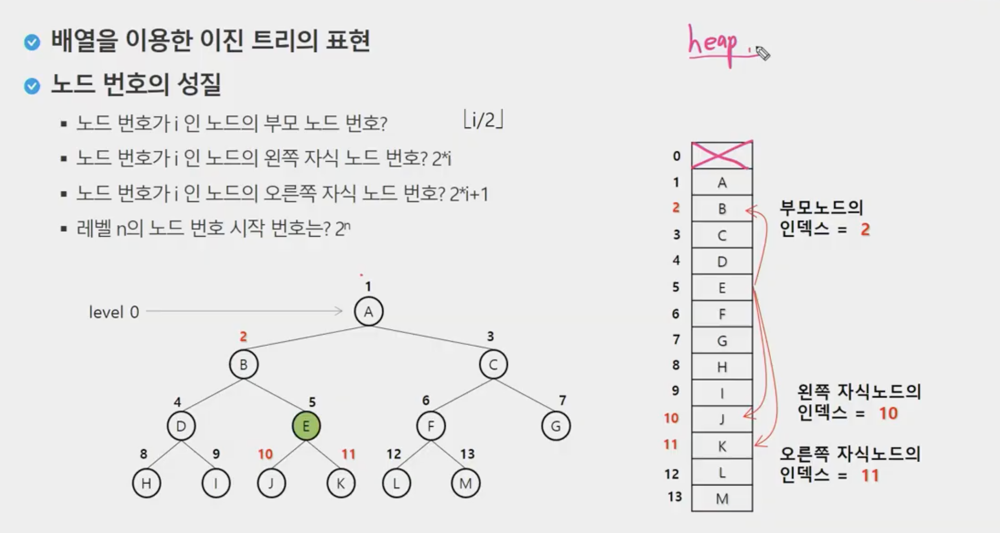
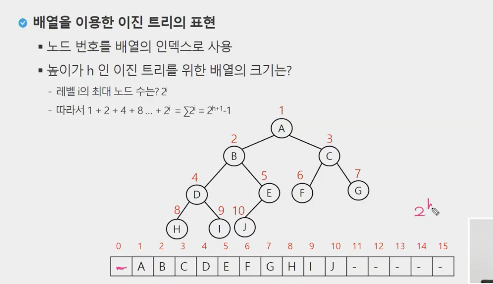
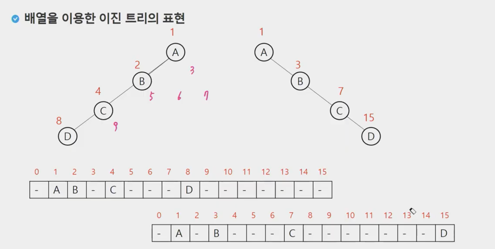
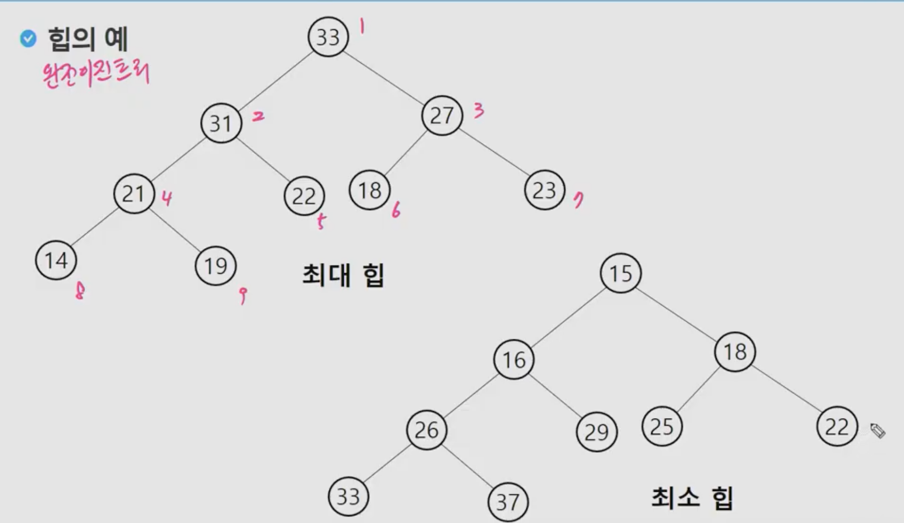
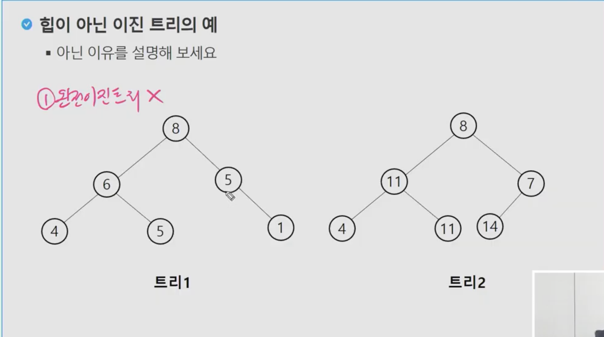

# 0909 트리, 이진트리, 힙

## 0. 선형구조, 비선형구조

- 선형구조 
  - 1대1의 관계 (파이썬 list)
  - 순회 for문

- 비선형구조
  - 트리, 1:N 관계
  - 그래프 N:N 관계
  - 사실상 트리는 이진트리를 의미하며, 이진트리가 아닌 트리는 그래프를 처리하는 방법을 사용한다

- 표현/탐색방법
  - 이진트리 (1:N)
    - 1차원 배열
    - DFS/BFS를 쓰면 좀 불편함
    - 전위/중위/후위
  - 그래프(N:N) 
    - 인접행렬
    - 간선배열
    - DFS탐색
    - BFS탐색


## 1. 트리

- 노드(node)
- 간선(edge)
- 차수(degree)
  - 노드에 연결된 자식 노드의 수
  - 트리에 있는 노드의 차수 중에서 가장 큰 값
  - 단말 노드(리프노드): 차수가 0인 노드, 자식노드가 없는 노드
- 높이
  - 루트에서 노드에 이르는 간선의 수, 노드의 레벨
  - 트리의 높이: 트리에 있는 노드의 높이 중에서 가장 큰 값. 최대 레벨


### 이진트리

> 모든 노드들이 2개의 서브트리를 갖는 특별한 형태의 트리
>
> 각 노드의 자식이 2개 이하

#### 특성

- 레벨 i에서 노드의 최대 갯수는 2**i
- 높이가 h인 이진트리가 가질 수 있는 노드의 최소 갯수는 (h+1)개가 되며 최대 갯수는 2**(h+1)-1

#### 종류

1. **포화 이진 트리(Full Binary Tree)**
   - 모든 레벨에 노드가 포화상태로 꽉 차 있는 이진 트리
   - 높이가 h일때, 최대의 노드 개수인 2**(h+1)-1의 노드를 가진 이진 트리
   - 높이 3일 때 2^(3+1)-1 = 15개 노드
   - 루트를 1번으로 하여 2^(h+1)-1까지 정해진 위치에 대한 노드 번호를 가짐
2. **완전 이진 트리(Complete Binary Tree)**
   - 높이가 h이고 노드 수가 n개 일 때, (단, h+1 <= n > 2^(h+1)-1), 포화 이진 트리의 노드 번호 1번부터 n번까지 빈 자리가 없는 이진 트리
   - 한 마디로 왼쪽부터 순서대로 채운 트리
   - 따라서, 마지막 계층 전 계층까지는 포화 이진트리의 형태를 보인다. 
3. **편향 이진 트리(Skewed binary Tree)**
   - 높이 h에 대한 최소 개수의 노드를 가지면서 한쪽 방향의 자식 노드만을 가진 이진 트리
     - 왼쪽 편향 이진트리, 오른쪽 편향 이진트리
     - 사실상 트리로서의 가치가 없음

### 순회(Traversal)

> 트리의 각 노드를 중복되지 않게 전부 방문하는 것. 
>
> 하지만 비 선형 구조이기 때문에 선후 연결관계를 알기 어려우므로, 특별한 방법이 필요하다

방법: 트리의 노드들을 체계적으로 방문하는 것

1. **전위순회(preorder) VLR**
   - 루트를 먼저 방문하고 왼쪽, 오른쪽으로 방문
2. **중위순회(inorder) LVR**
   - 왼쪽 노드의 자식을 먼저 살펴보고 루트를 살핀뒤 오른쪽 노드를 순회
3. **후위순회(postorder) LRV**
   - 자식노드 먼저 방문한 후 루트를 마지막으로 순회


#### 전위 순회 

>  깊이우선탐색(DFS)형태로 타고 들어감

```python
def preorder_traverse(T):
    if T:
        visit(T)						#방문하라는 것이지, 방문배열에 처리하라는 뜻이 아님
        preorder_traverse(T.left)		#
		preorder_traverse(T.right)
```

#### 후위 순회

```python
def postorder_traverse(T):
    if T:
        postorder_traverse(T.left)
        postorder_traverse(T.right)
        visit(T)
```

#### 중위순회

```python
def inorder_traverse(T):
    if T:
        inorder_traverse(T.left)
        visit(T)
        inorder_traverse(T.right)
```







## 2. 수식 트리

수식 이진 트리

연산자는 루트 노드이거나 가지 노드

피연산자는 모두 잎노드

후위순회를 해야함

### 이진 탐색 트리

> 탐색 작업을 효율적으로 하기 위한 자료구조

#### 특성

- 모든 원소는 서로 다른 유일한 키를 갖음
- 왼쪽 서브트리 < 루트 노드 < 오른쪽 서브트리
- 왼쪽 서브트리와 오른쪽 서브트리도 이진 탐색 트리
- 중위 순회하면 오름차순 결과를 얻을 수 있다

#### 성능

탐색, 삽입, 삭제 시간은 트리의 높이 만큼 시간이 걸린다

- O(h)

##### 배열과 성능 비교

- 배열의 순차검색 O(N)
- 이진탐색 - 정렬되어 있는 상태 O(logN)
- 이진 탐색 트리에서의 평균 O(logN)
  - 최악의 경우 O(N)
- 해쉬 검색 O(1)


### 탐색연산 

- 루트에서 시작
- 탐색할 키 값 x를 

#### 삭제

1. 단말 노드의 경우
   - 단순하게 삭제
2. 자식이 하나 있는 노드의 경우
   - 지우고 자식 노드를 끌어온다. (= 해당 노드를 삭제하고 해당 노드의 자식노드와 부모노드를 연결)
3. 자식이 두 개 있는 노드의 경우
   - 왼쪽 트리의 가장 오른쪽과 교체 후 대체된 해당 노드를 삭제


## 3. 힙 heap

> 완전 이진 트리에 있는 노드 중에서 키 값이 가장 큰 노드나 키 값이 가장 작은 노드를 찾기 위해서 만든 자료구조

#### 최대 힙 max

- 키 값이 가장 큰 노드를 찾기 위한 <u>**완전 이진 트리**</u>
- `부모노드의 키 값 > 자식 노드의 키 값`
- 루트 노드: 키 값이 가장 큰 노드

#### 최소 힙 min heap

- 키 값이 가장 작은 노드를 찾기 위한 <u>**완전 이진 트리**</u>
- `부모 노드의 키 값 < 자식 노드의 키 값`
- 루트 노드: 키 값이 가장 작은 노드






