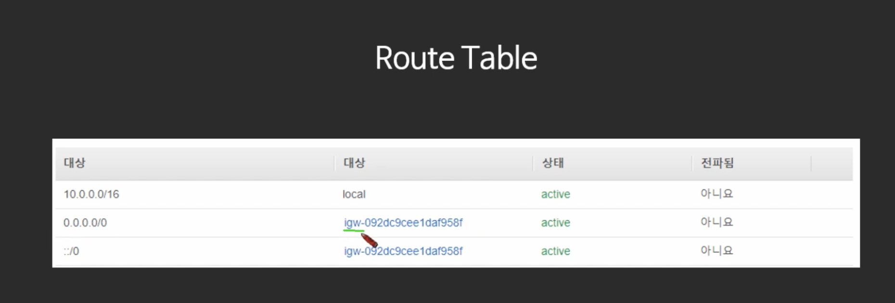

# AWS VPC 

- EC2+EBS+AMI -> Security group
- Security Group A, B 등으로 확장되면 ELB group
- 여기에 Auto Scaling Group이 추가되고
- 이 모든 것들을 포함하는 VPC (Vertual Private Cloud)개념이 오늘 다룰 내용이다

[TOC]

## 1. VPC란?
> aws 클라우드에서 논리적으로 격리된 공간을 프로비저닝하여 고객이 정의하는 가상 네트워크에서 aws리소스를 시작할 수 있습니다. IP주소 범위 선택, 서브넷 생성, 라우팅 테이블 및 네트워크 게이트웨이 구성 등 가상 네트워킹 환경을 완벽하게 제어할 수 있습니다. 
- IPv4, IPv6모두 지원
- 간단하게 말하면, 나만의 가상 네트워크 센터

1. default VPC
   -  계정 생성시 자동으로 셋업 (모든 리전)
   -  모든 서브넷의 인터넷 접근이 가능
   -  ec2가 퍼블릭 IP와 프라이빗 IP모두 가지고 있음
   - 삭제 시 복구 불가 (따라서 굳이 삭제할 필요는 없음.)
2. custom VPC
  - 새로 만들어야 함
  - DefaultVPC의 특징을 가지고 있지 않음

### 1.1. VPC를 사용하면 할 수 있는 것은 무엇인가?
- ec2실행 가능
- 서브넷 구성 가능
- 보안설정 (특정 IP block, 인터넷에 노출되지 않은 EC2구성 가능)
- 여러 VPC간 연결 가능 (원래대로라면 같은 VPC내부에서만 서로 접근,연결 가능하지만 VPC peering이라는 기능을 사용하면 VPC간 통신이 가능하다.)
  - but, Transitive Peering은 불가능하다!
    한다리 건너서 연결되어있는 것들 끼리는 Peering된 것이 아니다. (친구의 친구라 해서 내친구는 아니다. Solutions architect 시험 단골 문제임.)
- VPC Flow log: VPC 로그를 CLOUD WATCH에 저장이 가능하다.
- IP대역 지정 가능
- Region 당 하다. 다른 Region으로 확장 불가능!

## 2. VPC 구성요소
### 2.1. Availbility Zone (AZ)
> 물리적으로 분리되어 있는 인프라가 모여있는 데이터 센터
- 고가용성을 위해서 항상 일정 거리 이상 떨어져 있다.
- 하나의 리전은 2개 이상의 AZ로 이루어져 있다.
- 각 계정의 AZ는 다른 계정의 AZ와 다른 아이디를 부여 받음.
  - 계정 1의 AZ-A와 계정 2의 AZ-A는 서로 다르다 (랜덤 -> 보안성을 높이고 균등한 데이터 분할을 위해)
### 2.2. Subnet
> VPC의 하위 단위
- 하나의 AZ에만 생성 가능: 다른 AZ로 확장 불가 (시험 빈출)
  - 하나의 AZ에는 여러 Subnet생성 가능
- Private Subnet: 인터넷에 접근 불가능한 subnet
  - 보안을 위해. 데이터베이스, 로직처리 등 인터넷에 굳이 접근하도록 하여 해커의 접근을 차단함.
- public subnet: 인터넷에 접근 가능한 subnet.
  - 웹서버, 웹어플리케이션 등 외부 접속 가능
- CIDR block range
  - IP주소를 분배하는 방법.
  - IP주소 대역을 지정해줄 수 있다.
  
### 2.3. Internet GateWay (IGW)
> 인터넷으로 나가는 통로
- 고가용성이 확보되어 있음.
  - 내부적으로는 여러개의 서버로 구성되어있고, 하나가 터져도 다른 것이 작동하도록 하는 로직이 이미 적용되어있음.
- IGW로 연결되어있지 않은 서브넷 = Private Subnet
- RouteTable에서 연결해줘야 함.

### 2.4. Network Access Control List/ Security Group (NACL)
> 검문소
- NACL: Stateless, SecurityGroup : Stateful
- 기본적으로 VPC생성 때 만들어줌.
- ***Deny는 NACL에서만 가능하다.***
- AvailityZone에 가기 전에 최전선에 위치해있다.

### 2.5. Route Table
> 트래픽이 어디로 가야할 지 알려주는 이정표.

10.0.0.0/16 의 의미
10.0.0.1 ~ 10.0.255.255 까지는 LOCAL로 보내달라! (내부망)
나머지는 igw-~ 로 보내달라 (PUBLIC 접근 가능)

### 2.6. Network Address Translation Instance/NAT Gateway (NAT)

> Private Instance가 외부의 인터넷과 통신하기 위한 통로

- 외부 인터넷과 연결된 public  서브넷에게 트래픽을 전달해달라고 요청한다. (같은 VPC내에서는 내부 통신이 가능하기 때문에)
- NAT Instance는 단일 instance( EC2 ), NAT gateway는 AWS 서비스. 따라서 NAT instance는 정지되면 사라지지만 NAT Gateway는 사라지지 않는다.

- NAT instance를 사용할 때 Source / Destination check을 해제해야 한다. (기본적으로 EC2와 같으므로 출발지거나 도착지라고 여겨지기 때문이다.)

- NAT instance는 public 서브넷 내에 존재한다.

  

### 2.7. Bastion Host

> Pivate subnet에 접근하기 위한 Instance

- public subnet에 위치해야 함
- NAT instance는 Bastion host를 겸할 수 있지만,  NAT Gateway는 겸할 수 없다.
- 

### 2.8. VPC 엔드포인트

> VPC 엔드포인트를 통해 인터넷 게이트웨이, NAT디바이스, VPN연결 또는  AWS direct Connect 연결을 필요로 하지 않고 AWS PrivateLink 구동지원 AWS 서비스 및 VPC 엔드포인트 서비스에 비공개로 연결할 수 있습니다. VPC의 인스턴스는 서비스의 리소스와 통신하는데 퍼블릭 IP주소를 필요로 하지 않습니다. VPC와 기타 서비스 간의 트래픽은 Amazon네트워크를 벗어나지 않습니다.

요약: AWS 바깥으로 트래픽이 나가지 않고 AWS의 여러 서비스를 사용할 수 있게 해주는 AWS의 서비스

-> Private Subnet같은 경우 인터넷과 연결이 되어있지 않아 외부와의 접점이 없다. 그럼에도 불구하고 VPC 엔드포인트를 활용하면 S3, DynamoDb, Lambda등 다양한 AWS 서비스들에 접속할 수 있다.

1. Interface Endpoint (ENI : Elastic Network Interface)기반
   - Private IP를 만들어 서비스로 연결시켜줌
   - 많은 서비스들을 지원 (SQS, SNS, KINESIS, Sagemaker)
2. Gateway Endpoint: 라우팅 테이블에서 경로의 대상으로 지정하여 사용
   - S3 & DynamoDB 지원

## 3. VPC 만들기 실습
실습1.  VPC마법사 없이 직접설정해서 만들어보기

실습2. Basition host만들어서 private EC2접속하기

- 

실습3. S3 Gateway endpoint만들어서 Private Instance에서 S3데이터를 조회하기
